<!-- ═══════════════════════════════════════════════════════════════ -->
<!--            AAWESH KR · GitHub Profile README · 2028           -->
<!-- ═══════════════════════════════════════════════════════════════ -->

<div align="center">



<!-- TYPING ANIMATION -->
<a href="https://git.io/typing-svg">
  
</a>

<br/>

<!-- STATUS BADGES ROW -->


<br/>

<!-- PROFILE VIEWS + TROPHIES -->


</div>

---

## `> whoami`

```bash
$ cat profile.json
{
  "name"       : "Aawesh Kr",
  "alias"      : "aaweshdas",
  "role"       : "B.Tech CSE Student · Full-Stack Developer · AI Builder",
  "university" : "India",
  "year"       : "3rd Year",
  "graduating" : 2028,
  "pronouns"   : "He/Him · Mr. Aawesh",
  "flagship"   : "Dorothy — A Personal AI System",
  "focus"      : ["Full-Stack Dev", "Competitive Programming", "AI Engineering"],
  "email"      : "aaravdas208@gmail.com",
  "fun_fact"   : "I Love Tech and Tech Loves Me ⚡"
}
```

---

## `> current_processes`

| Flag | Process | Status |
|------|----------|--------|
| 🔭 | Building **Dorothy** — a Personal AI Companion | `ACTIVE` |
| 🌱 | Grinding **Competitive Programming** — DSA & Algorithms | `RUNNING` |
| 👯 | Looking for collaborators on **Dorothy AI** | `OPEN` |
| 🤔 | Seeking guidance on **AI architecture & LLM integration** | `SEEKING` |
| 💬 | Ask me about **Tech, Full-Stack, Cloud, AI** | `READY` |
| 📫 | Reach me at **aaravdas208@gmail.com** | `24/7` |

---

## `> tech_stack --all`

### 💻 Core Languages


### ⚡ Frontend & Mobile


### ☁️ Cloud & DevOps


### 🗄️ Databases


### 🎨 Design & Game Dev


---

## `> featured_projects`

<div align="center">

<!-- Dorothy AI -->
<a href="https://github.com/aaweshdas">
  
</a>

</div>

> **🤖 Dorothy** — My flagship project. A personal AI companion with voice, context memory, and deep personalisation. Built on Python, Next.js, and modern LLM APIs.
>
> **📊 CP Archive** — Personal competitive programming solution archive across Codeforces, LeetCode, and GFG.
>
> **🎮 Game Prototype** — 3D procedural world exploration with AI-driven NPCs in Unity + Blender.

---

## `> github_analytics`

<div align="center">


<br/>


<br/>

<!-- GitHub Activity Graph -->


</div>

---

## `> achievements`

<div align="center">


</div>

---

## `> timeline --career`

```
2021 ──── Started B.Tech CSE ──────────────── First line of code. Hello, World.
  │
2022 ──── Discovered Full-Stack ───────────── React. Node. Never looked back.
  │
2023 ──── Competitive Programming ─────────── Codeforces · LeetCode · GFG
  │
2024 ──── Dorothy AI — Conceived ──────────── Vision: an AI that truly knows you
  │
2025 ──── Dorothy AI — In Development ──────── Building in public
  │
2026 ──── [CURRENT] Year 3 ────────────────── Deep work. Deep focus.
  │
2027 ──── Final Year Projects ─────────────── Thesis. Internship. Ship it.
  │
2028 ──── 🎓 GRADUATION ────────────────────── B.Tech CSE · The beginning, not the end.
```

---

## `> goals --2028`

- [ ] 🤖 Ship **Dorothy AI** public beta
- [ ] 📈 Solve **1000+ competitive programming** problems
- [ ] 🌍 Contribute to **10+ open-source** projects
- [ ] 💼 Land a **top-tier SWE internship**
- [ ] 🎓 Graduate with distinction — **Class of 2028**

---


## `> connect --social`

<div align="center">

[](mailto:aaravdas208@gmail.com)

<br/>

[](https://instagram.com/aaweshdas)
[](https://linkedin.com/in/aaweshdas)
[](https://x.com/aaweshdas)
[](https://youtube.com/@aaweshdas)
[](https://twitch.tv/aaweshdas)

</div>

---

## `> support --buy_coffee`

<div align="center">

If my projects or tech support helped you — consider fuelling the late-night coding sessions ☕

[](https://buymeacoffee.com/aaweshdas)
[](https://paypal.me/aaweshdas)

</div>

---

<div align="center">


</div>
