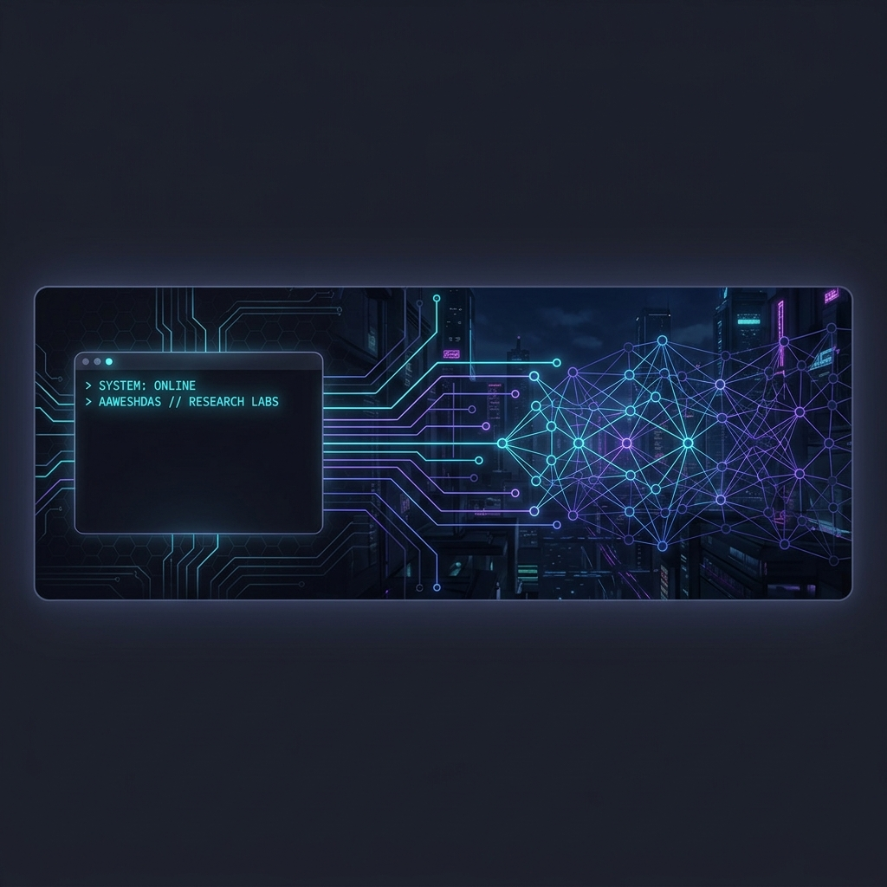

<!-- HEADER BANNER -->
<p align="center">
  <!-- NOTE: If you host this README on GitHub, the profile_header.png will show automatically if pushed to the same repository. -->
  
</p>

<!-- CORE INTERACTIVE TITLE -->
<div align="center">
  <h1>🛸 AAWESH KR // SYSTEM.CORE</h1>
  <p>
    
    
    
  </p>
  
  <h3>"Engineering intelligent systems and premium, highly responsive user experiences."</h3>
</div>

<br/>

<!-- SYSTEM DIAGNOSTICS - TERMINAL GRID -->
<table align="center" width="100%" style="border-collapse: collapse; border: 1px solid #1f2335; background-color: #0d1117; color: #a9b1d6; font-family: monospace;">
  <tr>
    <td style="padding: 15px;">
      <pre align="left" style="margin: 0; line-height: 1.5; font-size: 13px; color: #a9b1d6; background-color: #0d1117;">
<b>aaweshdas@nexus-terminal:~$</b> systemctl status aawesh_profile.service
● aawesh_profile.service - Aawesh Kr (B.Tech Computer Science & Engineering)
     Loaded: loaded (/etc/systemd/system/aawesh_profile.service; enabled)
     Active: <font color="#00FF66">active (running)</font> since B.Tech Cycle Year 1
   Main PID: 3122004 (core-architect)
      Tasks: O(log n) efficiency optimization
     Memory: Infinite Learning Capacity
        CPU: 100% focused on Competitive Programming & Cognitive AI

<b>aaweshdas@nexus-terminal:~$</b> cat focus_parameters.json
{
  <font color="#00E5FF">"current_focus"</font>: "Advanced Machine Learning, Competitive Programming, Full-Stack Optimization",
  <font color="#00E5FF">"active_initiative"</font>: "Dorothy AI — Advanced Personal Digital Intelligence Ecosystem",
  <font color="#00E5FF">"core_attributes"</font>: ["Systems Architect", "Problem Solver", "AI Orchestrator", "UX Designer"],
  <font color="#00E5FF">"academic_domain"</font>: "Computer Science & Engineering, III Year",
  <font color="#00E5FF">"operating_philosophy"</font>: "Code is poetry backed by mathematics. Build systems that empower human potential."
}

<b>aaweshdas@nexus-terminal:~$</b> <span style="animation: blink 1s infinite;">█</span></pre>
    </td>
  </tr>
</table>

<br/>

## 🧠 The Research Labs (Workspace Projects)

Here are the primary engineering initiatives active in my development environment:

<details open>
<summary><b>🤖 Cognitive Intelligence Systems</b></summary>
<br/>

*   **[DOROTHY AI](file:///s:/All%20Code/Antigravity/DOROTHY)**
    *   *Role:* Main Developer & System Architect
    *   *Concept:* An advanced cognitive personal AI ecosystem designed to execute workspace actions, handle contextual queries, and manage personal schedules seamlessly.
    *   *Stack:* `Python`, `Node.js`, `Large Language Models`, `Vector Databases`, `APIs`

*   **[S.A.R.A_AI](file:///s:/All%20Code/Antigravity/S.A.R.A_AI) & [FRIDAY](file:///s:/All%20Code/Antigravity/FRIDAY)**
    *   *Concept:* Specialized desktop and system integration AI environments focused on voice triggers, home/system automation, and prompt optimization protocols.
    *   *Stack:* `Python`, `SpeechRecognition`, `NLP Models`, `OS APIs`

</details>

<details open>
<summary><b>🌐 Premium Applications & Web Architectures</b></summary>
<br/>

*   **[Nexal App](file:///s:/All%20Code/Antigravity/Nexal_App) & [Nexio Web](file:///s:/All%20Code/Antigravity/Nexio%20Web)**
    *   *Concept:* High-performance application interfaces styled with premium aesthetic principles (vibrant dark schemes, glassmorphism, responsive visual grids).
    *   *Stack:* `Next.js`, `React Native`, `Figma`, `NodeJS`, `TailwindCSS`

*   **[Attendify](file:///s:/All%20Code/Antigravity/Attendify) & [World Monitor](file:///s:/All%20Code/Antigravity/worldmonitor)**
    *   *Concept:* Interactive schedules, real-time analytics platforms, and operations management dashboards designed to resolve organizational bottlenecks.
    *   *Stack:* `React`, `Supabase`, `Prisma`, `MySQL`, `RESTful APIs`

</details>

---

## 🛠️ The Tech Engine (Skill Matrix)

A high-tech matrix grouping the tools and core frameworks integrated into my daily engineering pipeline.

### 💻 Core Programming & Systems
```
[Languages] ── C++ ── Java ── Python ── JavaScript ── C
```
[](https://isocpp.org/)
[](https://www.oracle.com/java/)
[](https://www.python.org/)
[](https://developer.mozilla.org/en-US/docs/Web/JavaScript)
[](https://en.wikipedia.org/wiki/C_(programming_language))

### 🌐 Frontend & Mobile Architectures
```
[Frameworks] ─ Next.js ─ React ─ React Native ─ Flutter ─ Node.js
```
[](https://nextjs.org/)
[](https://react.dev/)
[](https://reactnative.dev/)
[](https://flutter.dev/)
[](https://nodejs.org/)

### 🗄️ Database & Cloud Telemetry
```
[Data & Cloud] Supabase ─ Prisma ─ MongoDB ─ MySQL ─ Airflow ─ AWS ─ GCP ─ Azure
```
[](https://supabase.com/)
[](https://www.prisma.io/)
[](https://www.mongodb.com/)
[](https://www.mysql.com/)
[](https://airflow.apache.org/)
[](https://aws.amazon.com/)
[](https://cloud.google.com/)
[](https://azure.microsoft.com/)

### 🎨 Creative Engineering & Game Engines
```
[Design & Game] Figma ─ Blender ─ Photoshop ─ Unity ─ Unreal Engine
```
[](https://figma.com/)
[](https://www.blender.org/)
[](https://www.adobe.com/products/photoshop.html)
[](https://unity.com/)
[](https://www.unrealengine.com/)

---

## 📊 Telemetry & Real-Time Performance

All metrics are updated continuously from GitHub APIs.

<div align="center">
  
</div>

<br/>

<div align="center">
  <table border="0" cellpadding="0" cellspacing="0">
    <tr>
      <td>
        
      </td>
      <td>
        
      </td>
    </tr>
    <tr>
      <td colspan="2" align="center">
        <br/>
        
      </td>
    </tr>
    <tr>
      <td colspan="2" align="center">
        <br/>
        
      </td>
    </tr>
  </table>
</div>

<br/>

<div align="center">
  <!-- Snake Game Animation -->
  
</div>

<br/>

---

## ✍️ Dynamic Dev Insights

<div align="center">
  
</div>

---

## 🌐 Channels of Synergy (Initiate Connection)

Feel free to connect on social media or request access to high-performance AI engines.

<p align="center">
  <a href="https://linkedin.com/in/aaweshdas" target="_blank"></a>
  <a href="mailto:aaravdas208@gmail.com"></a>
  <a href="https://x.com/aaweshdas" target="_blank"></a>
  <a href="https://instagram.com/aaweshdas" target="_blank"></a>
  <a href="https://youtube.com/@aaweshdas" target="_blank"></a>
  <a href="https://twitch.tv/aaweshdas" target="_blank"></a>
</p>

<div align="center">
  <h3>⚡ System Fuel & Subscriptions</h3>
  <p>
    <a href="https://buymeacoffee.com/aaweshdas" target="_blank"></a>
    &nbsp;&nbsp;
    <a href="https://paypal.me/aaweshdas" target="_blank"></a>
  </p>
</div>

<br/>

<div align="center">
  <!-- Telemetry Tracker (Visitor count) -->
  <code>[SYSTEM METRICS] Visitor Index:</code>
  
</div>

<br/>

```
// TELEMETRY: END OF TRANSMISSION
// SYSTEM LEVEL: B.TECH CSE (III YEAR) // DEV INTERACTION MODULE ONLINE
```
